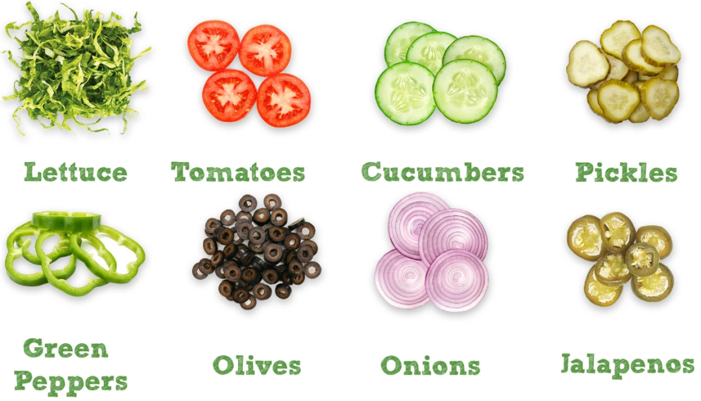
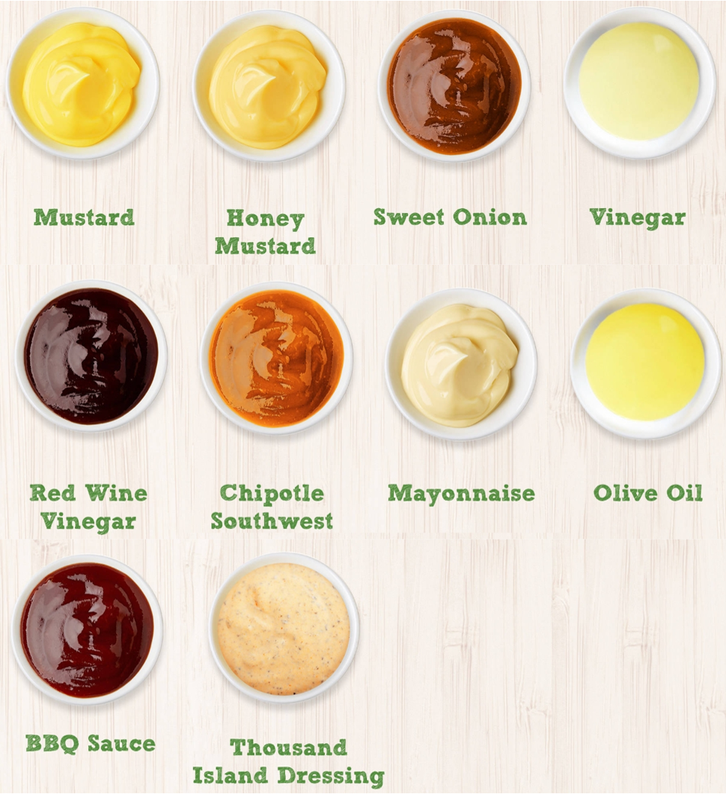
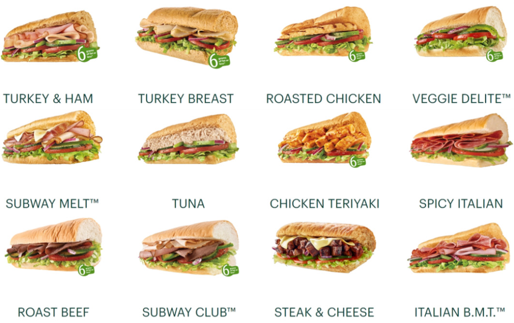
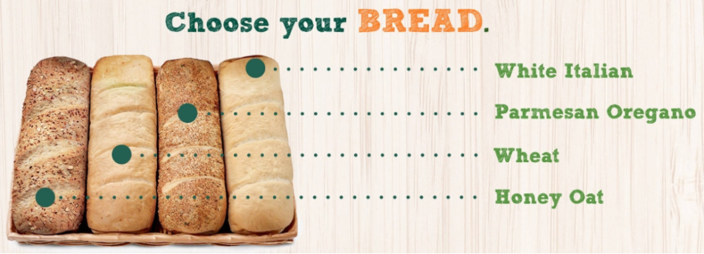

# Veggies

|1|2|3|4|
|-|-|-|-|
|Lettuce|Tomatoes|Cucumbers|Pickles|
|Green Peppers|Olives|Onions|Jalapenos|

- jalapeño /ˌhæləˈpeɪnjəʊ $ ˌhɑːləˈpeɪnjoʊ/  
a small, very hot pepper used especially in Mexican food.  

- spinach: 菠菜
- carrot: 胡萝卜
- corn: 玉米粒

## Sauce
- Mustard
- Honey Mustard
- Sweet Onion
- Vinegar
- Red Wine Vinegar
- Chipotle Southwest: 西南辣椒酱
- Mayonnaise
- Olive Oil
- BBQ Sauce
- Thousand Island Dressing

## Meat & Cheese

- Turkey & Ham
- Turkey Breast
- Roated Chicken
- Veggie $Delite^{TM}$
- Subway $Melt^{TM}$
- Tuna
- Chicken Teriyaki
- Spicy Italian
- Roast Beef
- Subway $Club^{TM}$
- Steak & Cheese
- Italian $B.M.T.^{TM}$

turkey 火鸡肉  
ham 火腿  
Salami 意大利腌肉香肠  
steak 牛排  
bacon 培根  
meat ball 肉丸  
chicken teriyaki 照烧鸡肉  

I.E.
- I'll go with chicken teriyaki.

### cheese
- American Cheese 
- cheddar cheese 切达芝士
- pepper Jack cheese 胡椒杰克芝士
- mozzarella 莫泽雷勒芝士

\- Would you like your sandwich toasted?  
\- I'd love it toasted. 

# Bread

- White Italian 
- Honey Oat 蜂蜜燕麦面包
- Italian Herbs and Cheese 意大利香草起司面包
- Flat bread 扁面包
- Monterey Cheddar 蒙特利切达面包

I.E.  
\- Which size sub would you like?  
\- Footlong. / 6-inch.  
\- "Can I get a 6-inch honey oat sub?"  

